# Chest X-Ray Multi-Disease Detection System

A comprehensive medical imaging system that combines multiple AI models and services for chest X-ray analysis and disease detection.
<div >
  <a href="https://www.tensorflow.org/"></a>
  <a href="https://fastapi.tiangolo.com/"></a>
  <a href="https://www.flutter.com/"></a>
  <a href="https://strapi.io/"></a>
  <a href="https://www.docker.com/"></a>
  <a href="https://grafana.com/"></a>
  <a href="https://ultralytics.com/yolov8"></a>
  <a href="https://redis.io/"></a>
  <a href="https://www.llamaindex.ai/"></a>
  <a href="https://ollama.com/"></a>
  <a href="https://www.postgresql.org/"></a>
</div>

## Table of Contents
- [Project Structure Overview](#project-structure-overview)
- [System Architecture](#system-architecture)
  - [CNN System Architecture](#cnn-system-architecture)
  - [RAG System Architecture](#rag-system-architecture)
  - [Technology Stack](#technology-stack)
- [Monitoring Interface](#monitoring-interface)
- [Content Management System](#content-management-system)
- [Application Demo](#application-demo)
- [Detailed Project Structure](#detailed-project-structure)
  - [Backend Services](#backend-services)
  - [Frontend](#frontend)
  - [Monitoring & Analytics](#monitoring--analytics)
- [Service Ports](#service-ports)
- [API Endpoints](#api-endpoints)
  - [be-fastapi-cnn](#be-fastapi-cnn)
  - [be-fastapi-yolo](#be-fastapi-yolo)
  - [be-rag](#be-rag)
  - [be-strapi](#be-strapi)
- [Getting Started](#getting-started)
- [Service Setup Guides](#service-setup-guides)
  - [be-fastapi-cnn Setup](#1-be-fastapi-cnn-setup)
  - [be-fastapi-yolo Setup](#2-be-fastapi-yolo-setup)
  - [be-rag Setup](#3-be-rag-setup)
  - [be-strapi Setup](#4-be-strapi-setup)
  - [Flutter Frontend Setup](#5-flutter-frontend-setup)
  - [Monitoring Stack Setup](#6-monitoring-stack-setup)
- [Development Workflow](#development-workflow)
- [Environment Variables](#environment-variables)
- [Contributing](#contributing)
- [License](#license)

## Project Structure Overview
```
chest-xray-multi-disease/
├── be-fastapi-cnn/               # CNN Disease Classification Service
│   ├── services/                 # Business logic services
│   ├── utils/                    # Utility functions
│   ├── models/                   # ML model files
│   ├── schemas/                  # Data schemas
│   ├── main.py                  # FastAPI application
│   └── requirements.txt         # Python dependencies
│
├── be-fastapi-yolo/             # YOLO Object Detection Service
│   ├── utils/                   # Utility functions
│   ├── models/                  # YOLO model files
│   ├── main.py                 # FastAPI application
│   └── requirements.txt        # Python dependencies
│
├── be-rag/                      # RAG Document Search Service
│   ├── app/
│   │   ├── api/                # API endpoints
│   │   ├── core/              # Core business logic
│   │   ├── indexing/          # Document indexing
│   │   ├── rag/              # RAG implementation
│   │   └── utils/            # Utility functions
│   ├── init-scripts/          # Database initialization
│   └── docker-compose.yml     # Service orchestration
│
├── be-strapi/                   # Content Management System
│   ├── src/                    # Source code
│   ├── config/                 # Strapi configurations
│   ├── database/              # Database configurations
│   └── public/                # Public assets
│
├── fe_flutter/                  # Flutter Frontend Application
│   ├── lib/                    # Application source code
│   ├── assets/                # Static assets
│   ├── test/                  # Test files
│   └── pubspec.yaml           # Flutter dependencies
│
├── grafana/                     # Monitoring UI
│   └── provisioning/
│       ├── dashboards/        # Dashboard configurations
│       └── datasources/       # Data source configurations
│
└── prometheus/                  # Metrics Collection
    └── prometheus.yml          # Prometheus configuration
```

## System Architecture

This project integrates multiple ML models and services in a microservices architecture. Below are the detailed system diagrams:

### CNN System Architecture

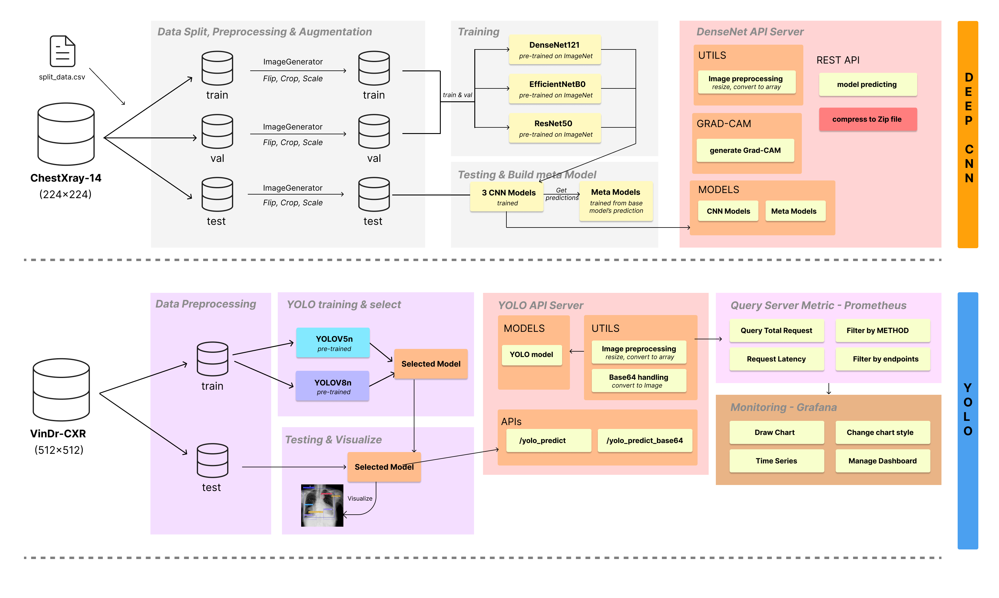

The CNN-based disease classification system follows a comprehensive pipeline:

1. **Data Split, Preprocessing & Augmentation**: 
   - Uses the ChestXray-14 dataset (224×224 images)
   - Handles train/validation/test splits
   - Implements image augmentation with flipping, cropping, and scaling

2. **Training**:
   - Multiple CNN models: DenseNet121, EfficientNetB0, ResNet50
   - All models pre-trained on ImageNet for transfer learning

3. **DenseNet API Server**:
   - Processes incoming images with preprocessing utilities
   - Generates Grad-CAM visualizations for explainability
   - Provides model predictions via REST API
   - Returns results in multiple formats (ZIP files, base64)

### RAG System Architecture

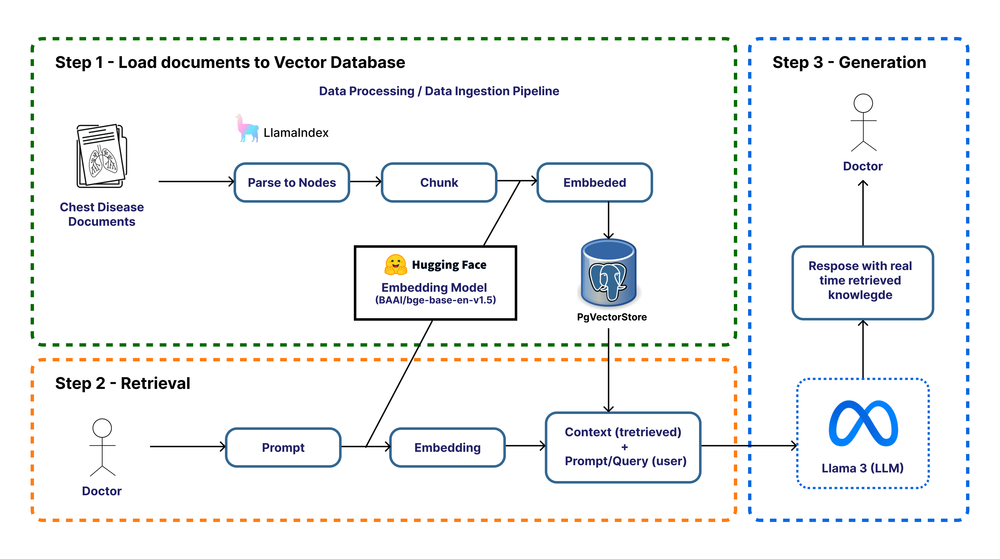

The Retrieval-Augmented Generation (RAG) system works in three main steps:

1. **Document Loading to Vector Database**:
   - Parses chest disease medical documents into nodes
   - Uses LlamaIndex for document processing
   - Chunks the content for better retrieval
   - Generates embeddings using Hugging Face models (BAAI/bge-base-en-v1.5)
   - Stores vectors in pgvector database

2. **Retrieval**:
   - Takes user prompts/queries from doctors
   - Converts queries to embeddings
   - Retrieves relevant context from the vector store
   - Combines retrieved context with the original query

3. **Generation**:
   - Uses Llama 3 LLM to generate responses
   - Provides real-time retrieved knowledge
   - Delivers medically accurate information based on the embedded documents

### Technology Stack


The project leverages a diverse set of technologies organized in a microservices architecture:

### Data Processing & Model Training
- **TensorFlow & Keras**: For CNN models implementation and training
- **PyTorch**: For various machine learning tasks
- **Ultralytics YOLO**: For object detection in chest X-rays
- **scikit-learn**: For data processing and metrics
- **Seaborn**: For data visualization

### AI Services
- **CNN Models**:
  - TensorFlow-based models (DenseNet121, EfficientNetB0, ResNet50)
  - Pre-trained on ImageNet for transfer learning
  
- **YOLO Models**:
  - Ultralytics YOLOv5 and YOLOv8
  - Custom-trained for medical imaging
  
- **RAG Implementation**:
  - LlamaIndex for document processing
  - Hugging Face embedding models (BAAI/bge-base-en-v1.5)
  - Llama 3 LLM for generation

### Backend Services
- **FastAPI**: High-performance API framework for Python services
- **GitHub Actions**: CI/CD for automated testing and deployment
- **PostgreSQL with pgvector**: Vector database for RAG service
- **Ollama**: Local LLM hosting

### Frontend
- **Flutter**: Cross-platform UI framework
- **Riverpod**: State management
- **Material Design**: UI components
- **Firebase**: Backend services for authentication and storage

### Infrastructure
- **Docker & Docker Compose**: Containerization and orchestration
- **Strapi CMS**: Content management system
- **SQLite**: Local database for Strapi
- **Grafana**: Metrics visualization and dashboards
- **Prometheus**: Metrics collection and monitoring

### Networking & Integration
- **REST APIs**: Service communication
- **Cloudinary**: Cloud image storage
- **JWT Authentication**: Secure API access
- **OpenAPI**: API documentation

This comprehensive stack enables end-to-end development, from data processing and model training to production deployment with monitoring and scalability.

## Monitoring Interface

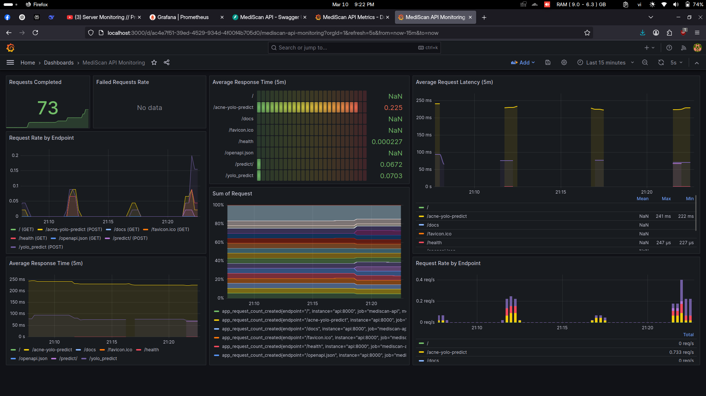

The project includes a comprehensive monitoring system using Grafana and Prometheus:

### Grafana Dashboards

The customized Grafana dashboard provides real-time insights into the performance of the AI services:

- **Request Metrics**:
  - Completed requests counter
  - Failed requests rate
  - Request rate by endpoint

- **Response Time Monitoring**:
  - Average response time (5m) for each endpoint
  - Average request latency (5m)
  - Detailed endpoint performance metrics

- **Endpoint-specific Metrics**:
  - YOLO prediction endpoint performance
  - CNN model inference times
  - Health check response times
  - Document processing metrics

The dashboard is configured to show both current and historical data, making it easy to identify performance trends and potential issues. All metrics are collected from the Prometheus instance that scrapes both the CNN and YOLO API services.

## Content Management System

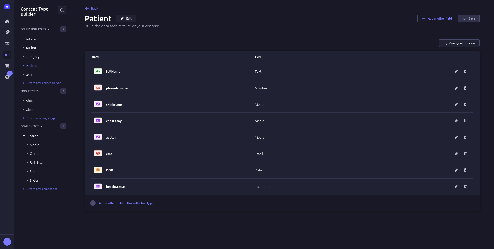

The project uses Strapi as its headless CMS to manage patient data and medical records:

### Strapi Content Types

- **Patient Records**:
  - Patient information including full name, phone number
  - Medical images (skin images, chest X-rays)
  - Patient avatar
  - Contact information
  - Date of birth
  - Health status with enumerated options

### CMS Features

- **Content Type Builder**: Easily define and modify data structures
- **Role-based Access Control**: Secure access to sensitive medical data
- **API Generation**: Automatic REST API endpoints for all content types
- **Media Management**: Handling of medical images and documents
- **Multi-language Support**: For patient records in multiple languages

The Strapi CMS integrates with the Flutter frontend through its REST API, providing a structured way to store and retrieve patient information and associated medical images. It also manages authentication and authorization for healthcare providers accessing the system.

## Application Demo

<table>
  <tr>
    <td>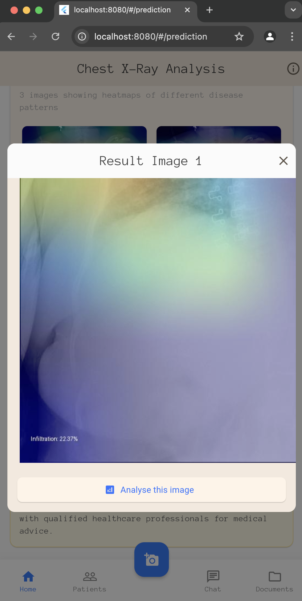</td>
    <td></td>
    <td>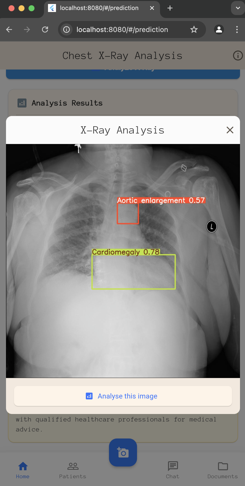</td>
    <td>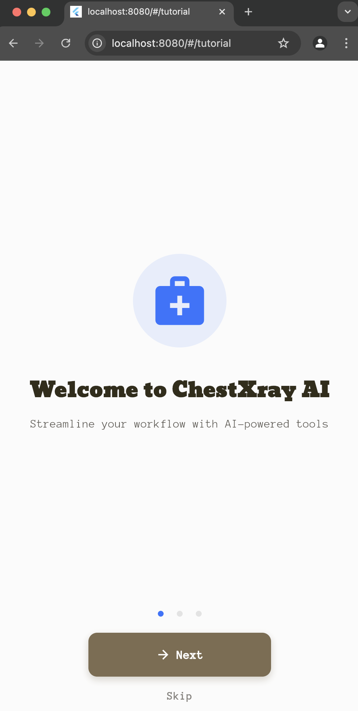</td>
    <td>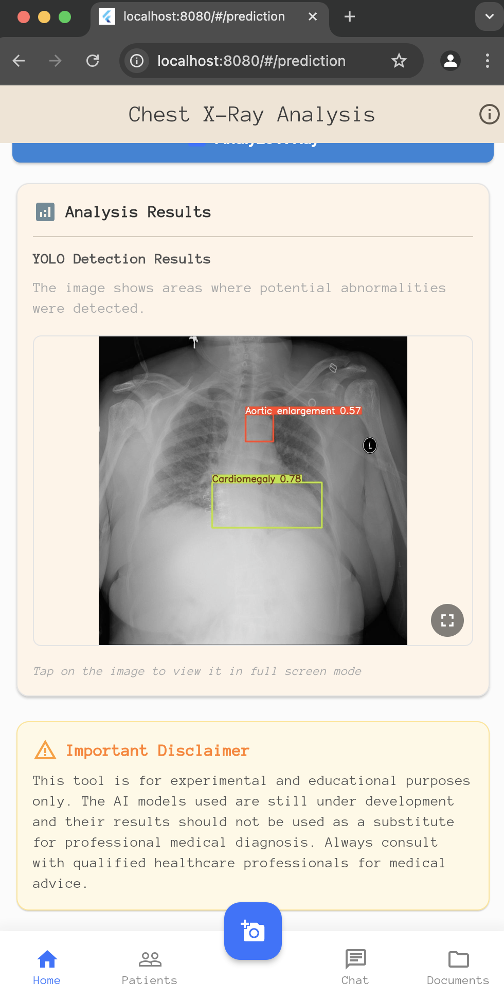</td>
    <td>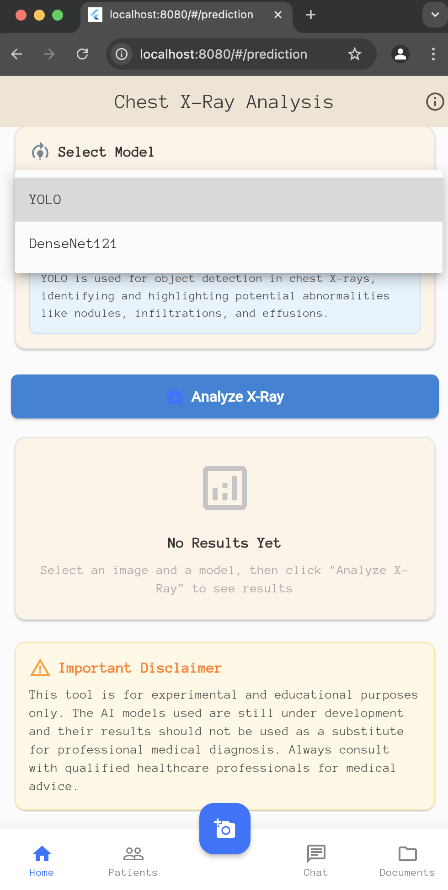</td>
    <td>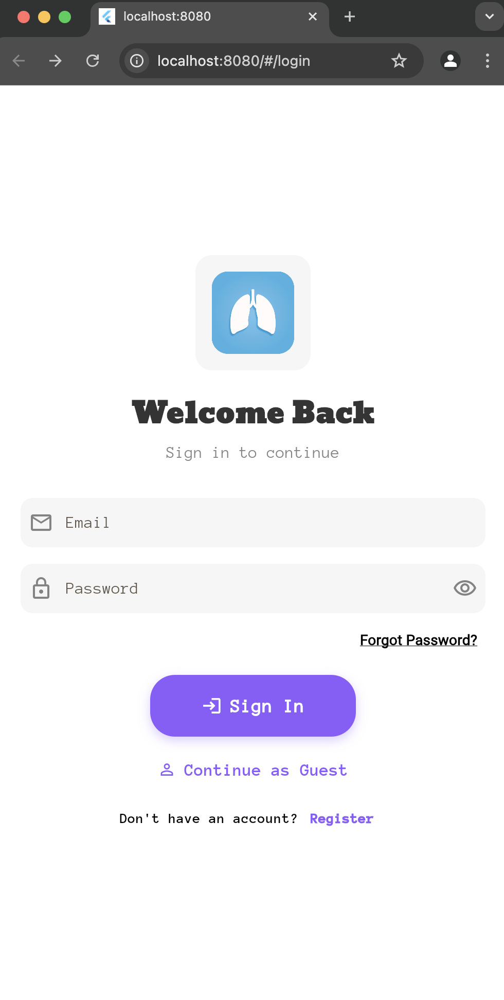</td>
  </tr>
  <tr>
    <td>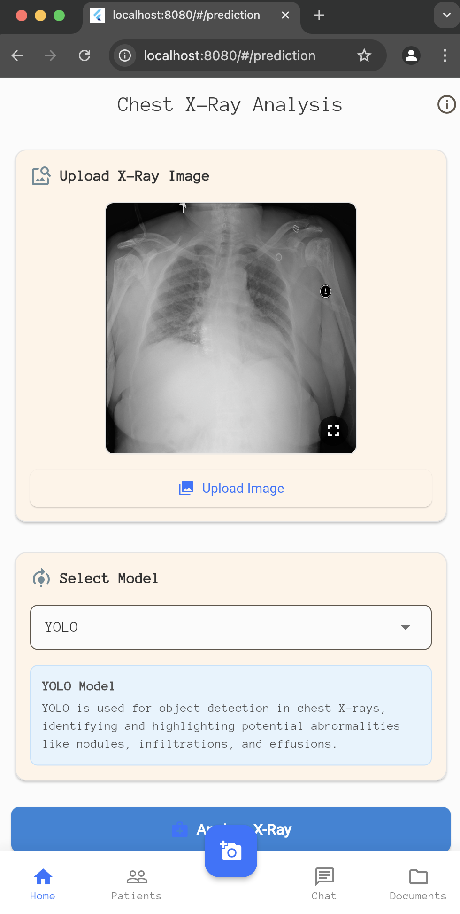</td>
    <td>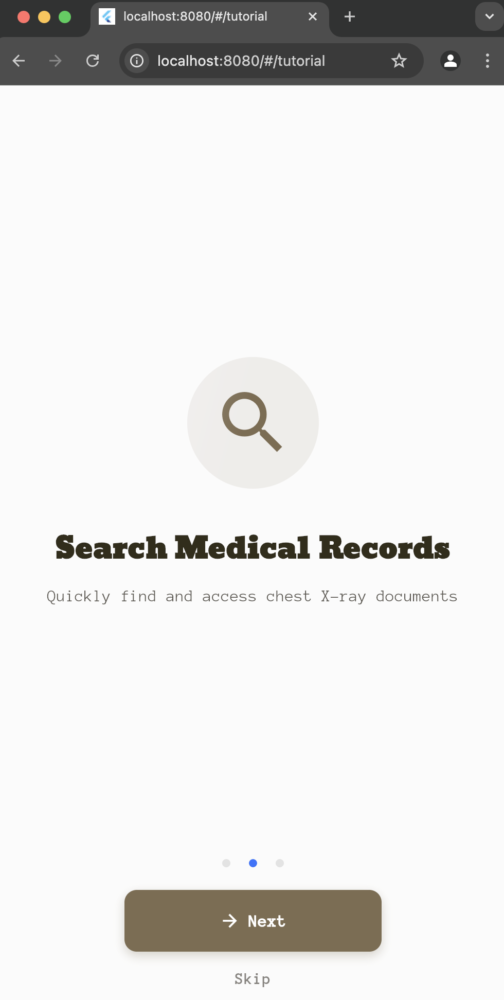</td>
    <td>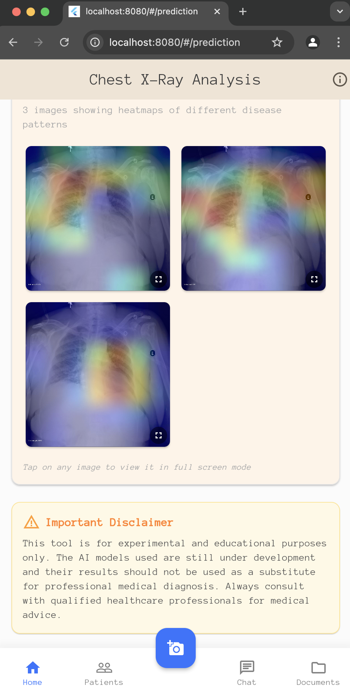</td>
    <td>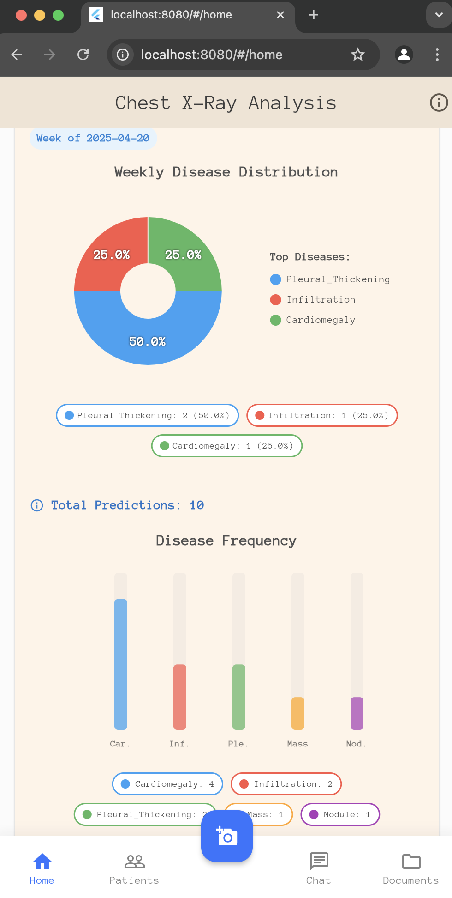</td>
    <td>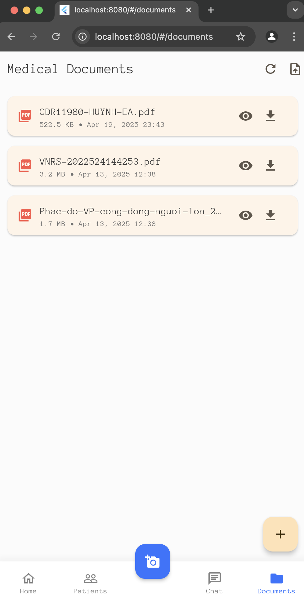</td>
    <td>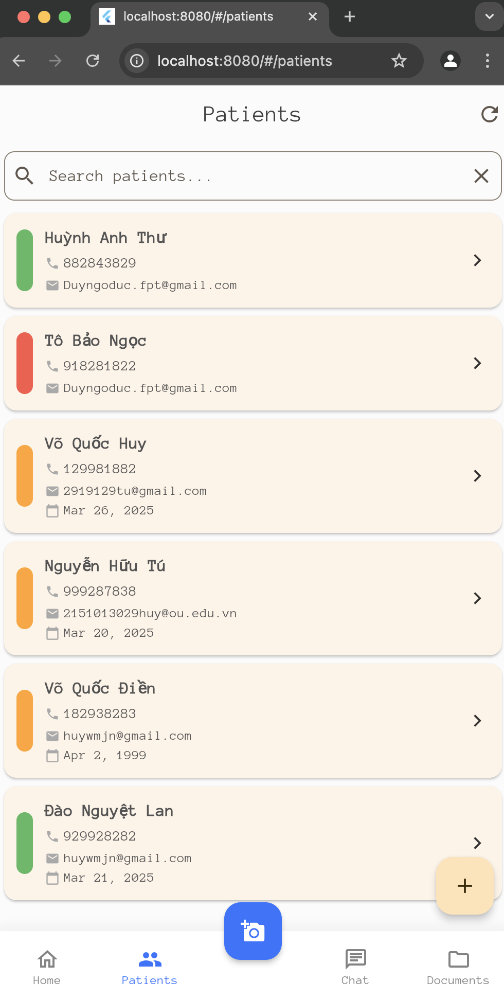</td>
    <td>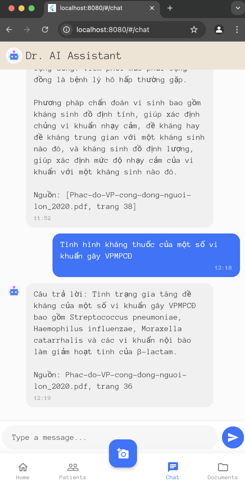</td>
  </tr>
</table>


## Detailed Project Structure

The project consists of several microservices and components:

### Backend Services

1. **be-fastapi-cnn** (Port: 5000)
   - DenseNet-based CNN model for chest X-ray classification
   - Features:
     - Disease prediction with GradCAM visualization
     - Support for both direct file upload and base64 image input
     - Disease statistics tracking (daily, weekly, summary)
     - Prometheus metrics integration
     - Cloudinary integration for image storage

2. **be-fastapi-yolo** (Port: 8000)
   - YOLO-based object detection for chest X-rays
   - Features:
     - Object detection with bounding boxes
     - Support for both file upload and base64 image input
     - Prometheus metrics integration
     - Health monitoring endpoints

3. **be-rag** (Port: 8003)
   - RAG (Retrieval-Augmented Generation) service for medical knowledge
   - Features:
     - Vector database (pgvector) for efficient similarity search
     - Integration with Ollama for LLM capabilities
     - Medical knowledge base querying
     - PostgreSQL for persistent storage

4. **be-strapi** (Port: 1337)
   - Strapi CMS for content management
   - Features:
     - User authentication and permissions
     - Content type builder
     - API generation
     - Entity relationship management

### Frontend

**fe_flutter**
- Cross-platform application built with Flutter
- Features:
  - Integration with all backend services
  - Material Design UI
  - State management with Riverpod
  - File handling and image processing
  - Charts and visualizations
  - Firebase integration
  - Offline capabilities
  - Responsive design

### Monitoring & Analytics

1. **Grafana** (Port: 3000)
   - Visualization and analytics platform
   - Custom dashboards for service monitoring
   - Integration with Prometheus

2. **Prometheus** (Port: 9090)
   - Metrics collection and monitoring
   - Configured to scrape metrics from:
     - be-fastapi-yolo
     - be-fastapi-cnn

## Service Ports

| Service | Port | Description | Health Check Endpoint |
|---------|------|-------------|---------------------|
| be-fastapi-cnn | 5000 | CNN-based disease classification | `/health` |
| be-fastapi-yolo | 8000 | YOLO-based object detection | `/health` |
| be-rag | 8003 | Document search and RAG service | `/health` |
| be-strapi | 1337 | Content Management System | `/healthz` |
| Grafana | 3000 | Metrics visualization | `/api/health` |
| Prometheus | 9090 | Metrics collection | `/-/healthy` |
| PostgreSQL (RAG) | 5432 | Vector database for RAG | N/A |

## API Endpoints

### be-fastapi-cnn
- POST `/densenet_predict` - Predict diseases with GradCAM visualization
- POST `/v2/densenet_predict` - Predict diseases with Cloudinary integration
- GET `/stats/diseases/weekly` - Get weekly disease statistics
- GET `/stats/diseases/summary` - Get overall disease prediction summary
- GET `/stats/diseases/daily` - Get daily disease statistics
- GET `/metrics` - Prometheus metrics endpoint
- GET `/health` - Health check endpoint

### be-fastapi-yolo
- POST `/predict/` - Object detection on uploaded image
- POST `/yolo_predict` - Process image and return annotated result
- POST `/yolo_predict_base64` - Process base64 image
- GET `/metrics` - Prometheus metrics endpoint
- GET `/health` - Health check endpoint

### be-rag
- POST `/search` - Search chest documents using RAG (Retrieval Augmented Generation) with Vietnamese responses
- GET `/documents` - List all PDF documents with metadata
- GET `/documents/{filename}/view` - View PDF document in browser
- GET `/documents/{filename}` - Download PDF document
- POST `/documents/upload` - Upload new PDF document (max 10MB)

### be-strapi
- RESTful API endpoints for content management
- Authentication endpoints
- Custom API endpoints based on content types

## Getting Started

1. Clone the repository
2. Set up environment variables for each service
3. Run the services using Docker Compose:
   ```bash
   docker-compose up
   ```

4. Access the services:
   - Flutter App: Run using Flutter CLI or IDE
   - Strapi Admin: http://localhost:1337/admin
   - Grafana: http://localhost:3000
   - Prometheus: http://localhost:9090

## Service Setup Guides

### 1. be-fastapi-cnn Setup
```bash
cd be-fastapi-cnn

# Create and activate virtual environment
python -m venv venv
source venv/bin/activate  # On Windows: venv\Scripts\activate

# Install dependencies
pip install -r requirements.txt

# Set up environment variables
cp .env.example .env
# Edit .env with your configurations:
# - MODEL_PATH: Path to your DenseNet model
# - CLOUDINARY credentials
# - Other service configurations

# Run the service
uvicorn main:app --host 0.0.0.0 --port 5000 --reload
```

### 2. be-fastapi-yolo Setup
```bash
cd be-fastapi-yolo

# Create and activate virtual environment
python -m venv venv
source venv/bin/activate  # On Windows: venv\Scripts\activate

# Install dependencies
pip install -r requirements.txt

# Set up environment variables
cp .env.example .env
# Edit .env with your configurations:
# - YOLO model settings
# - API configurations

# Run the service
uvicorn main:app --host 0.0.0.0 --port 8000 --reload
```

### 3. be-rag Setup
```bash
cd be-rag

# Start the database and API service using Docker Compose
docker-compose up -d

# If running locally without Docker:
cd app

# Create and activate virtual environment
python -m venv venv
source venv/bin/activate  # On Windows: venv\Scripts\activate

# Install dependencies
pip install -r requirements.txt

# Set up environment variables
cp .env.example .env
# Configure:
# - DATABASE settings
# - OLLAMA settings
# - Vector database configurations

# Run the service
uvicorn main:app --host 0.0.0.0 --port 8003 --reload
```

### 4. be-strapi Setup
```bash
cd be-strapi

# Install dependencies
npm install

# Set up environment variables
cp .env.example .env
# Configure:
# - Database settings
# - Admin credentials
# - API tokens

# Run development server
npm run develop

# For production
npm run build
npm run start
```

### 5. Flutter Frontend Setup
```bash
cd fe_flutter

# Install Flutter dependencies
flutter pub get

# Set up environment variables
cp .env.example .env
# Configure:
# - API endpoints
# - Firebase settings
# - Other service URLs

# Run the app in development
flutter run

# Build for production
flutter build web  # For web
flutter build apk  # For Android
flutter build ios  # For iOS (requires Mac)
```

### 6. Monitoring Stack Setup

#### Prometheus Setup
```bash
cd prometheus

# Configure prometheus.yml with your targets
# Default configuration includes:
# - be-fastapi-cnn metrics
# - be-fastapi-yolo metrics

# Run Prometheus
docker-compose up -d
```

#### Grafana Setup
```bash
cd grafana

# Configure datasources in provisioning/datasources
# Configure dashboards in provisioning/dashboards

# Run Grafana
docker-compose up -d

# Access Grafana at http://localhost:3000
# Default credentials: admin/admin
```

## Development Workflow

1. Start the backend services:
   ```bash
   # Start all services
   docker-compose up -d

   # Or start individual services as needed
   docker-compose up be-fastapi-cnn
   docker-compose up be-fastapi-yolo
   docker-compose up be-rag
   docker-compose up be-strapi
   ```

2. Start the monitoring stack:
   ```bash
   docker-compose up -d prometheus grafana
   ```

3. Run the Flutter app:
   ```bash
   cd fe_flutter
   flutter run
   ```

4. Access the services:
   - Flutter App: Runs on your device/emulator
   - Backend APIs: 
     - CNN API: http://localhost:5000
     - YOLO API: http://localhost:8000
     - RAG API: http://localhost:8003
     - Strapi: http://localhost:1337
   - Monitoring:
     - Grafana: http://localhost:3000
     - Prometheus: http://localhost:9090

## Environment Variables

Each service requires specific environment variables. Check the `.env.example` files in each service directory for required variables.

## Contributing
1. Fork the repository
2. Create a feature branch (git checkout -b feature/enhancement)
3. Commit changes (git commit -am 'Add enhancement')
4. Push branch (git push origin feature/enhancement)
5. Open a Pull Request


## License

MIT License - See [LICENSE](LICENSE) for details

