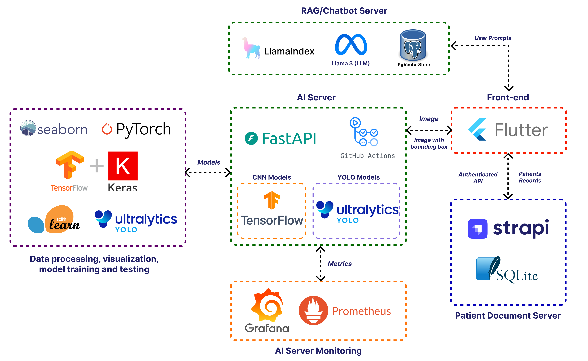
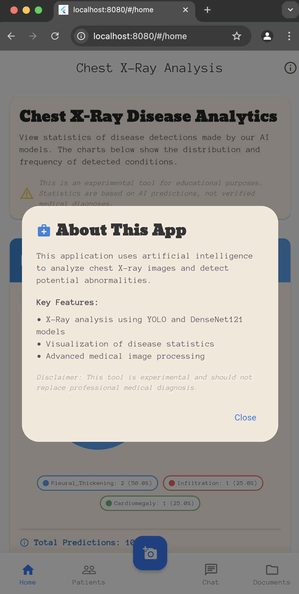
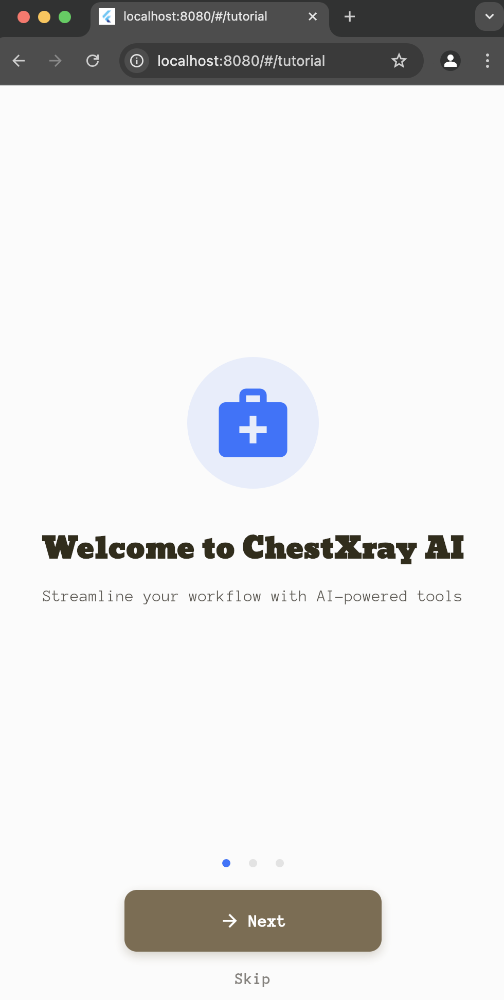
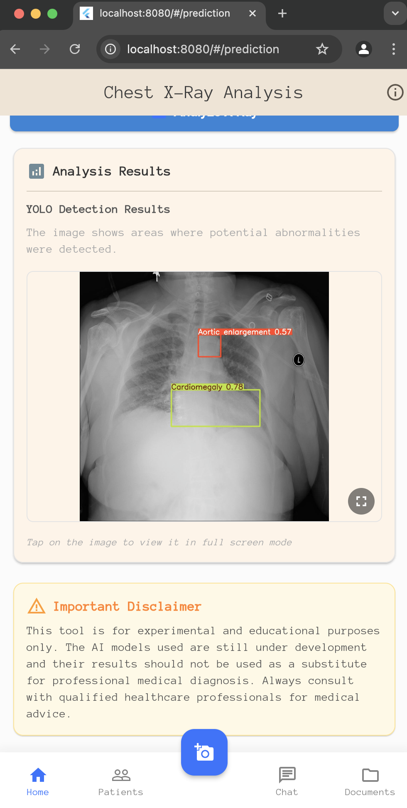
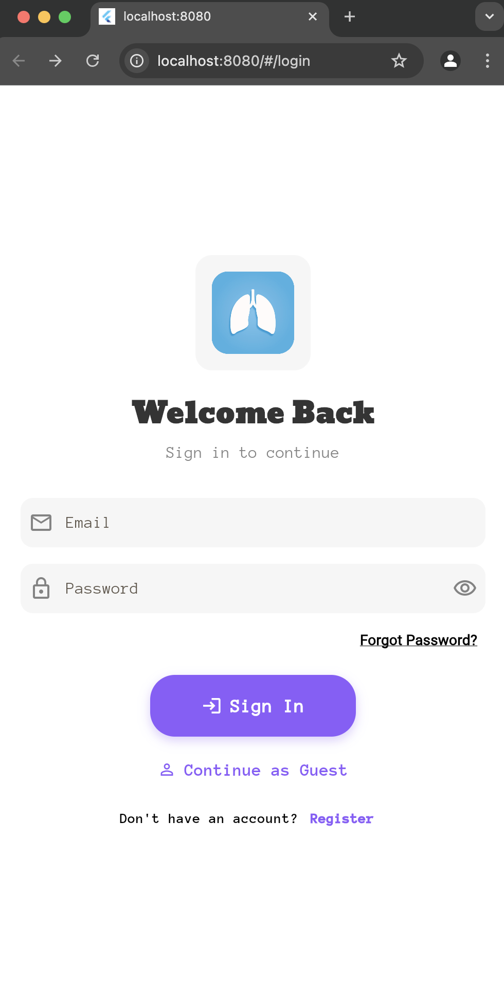

# Hệ Thống Phát Hiện Đa Bệnh Từ Ảnh X-quang Ngực

Một hệ thống hình ảnh y tế toàn diện kết hợp nhiều mô hình AI và dịch vụ để phân tích ảnh X-quang ngực và phát hiện bệnh.
<div >
  <a href="https://www.tensorflow.org/"></a>
  <a href="https://fastapi.tiangolo.com/"></a>
  <a href="https://www.flutter.com/"></a>
  <a href="https://strapi.io/"></a>
  <a href="https://www.docker.com/"></a>
  <a href="https://grafana.com/"></a>
  <a href="https://ultralytics.com/yolov8"></a>
  <a href="https://redis.io/"></a>
  <a href="https://www.llamaindex.ai/"></a>
  <a href="https://ollama.com/"></a>
  <a href="https://www.postgresql.org/"></a>
</div>

## Mục Lục
- [Tổng Quan Cấu Trúc Dự Án](#tong-quan-cau-truc-du-an)
- [Kiến Trúc Hệ Thống](#kien-truc-he-thong)
  - [Kiến Trúc Hệ Thống CNN](#kien-truc-he-thong-cnn)
  - [Kiến Trúc Hệ Thống RAG](#kien-truc-he-thong-rag)
  - [Ngăn Xếp Công Nghệ](#ngan-xep-cong-nghe)
- [Giao Diện Giám Sát](#giao-dien-giam-sat)
- [Hệ Thống Quản Lý Nội Dung](#he-thong-quan-ly-noi-dung)
- [Demo Ứng Dụng](#demo-ung-dung)
- [Cấu Trúc Dự Án Chi Tiết](#cau-truc-du-an-chi-tiet)
  - [Dịch Vụ Backend](#dich-vu-backend)
  - [Frontend](#frontend)
  - [Giám Sát & Phân Tích](#giam-sat-phan-tich)
- [Cổng Dịch Vụ](#cong-dich-vu)
- [API Endpoints](#api-endpoints)
  - [be-fastapi-cnn](#be-fastapi-cnn)
  - [be-fastapi-yolo](#be-fastapi-yolo)
  - [be-rag](#be-rag)
  - [be-strapi](#be-strapi)
- [Bắt Đầu](#bat-dau)
- [Hướng Dẫn Cài Đặt Dịch Vụ](#huong-dan-cai-dat-dich-vu)
  - [Cài Đặt be-fastapi-cnn](#cai-dat-be-fastapi-cnn)
  - [Cài Đặt be-fastapi-yolo](#cai-dat-be-fastapi-yolo)
  - [Cài Đặt be-rag](#cai-dat-be-rag)
  - [Cài Đặt be-strapi](#cai-dat-be-strapi)
  - [Cài Đặt Frontend Flutter](#cai-dat-frontend-flutter)
  - [Cài Đặt Ngăn Xếp Giám Sát](#cai-dat-ngan-xep-giam-sat)
- [Quy Trình Phát Triển](#quy-trinh-phat-trien)
- [Biến Môi Trường](#bien-moi-truong)
- [Đóng Góp](#dong-gop)
- [Giấy Phép](#giay-phep)

## Tổng Quan Cấu Trúc Dự Án
```
chest-xray-multi-disease/
├── be-fastapi-cnn/               # Dịch Vụ Phân Loại Bệnh CNN
│   ├── services/                 # Dịch vụ logic nghiệp vụ
│   ├── utils/                    # Hàm tiện ích
│   ├── models/                   # Tệp mô hình ML
│   ├── schemas/                  # Lược đồ dữ liệu
│   ├── main.py                  # Ứng dụng FastAPI
│   └── requirements.txt         # Phụ thuộc Python
│
├── be-fastapi-yolo/             # Dịch Vụ Phát Hiện Đối Tượng YOLO
│   ├── utils/                   # Hàm tiện ích
│   ├── models/                  # Tệp mô hình YOLO
│   ├── main.py                 # Ứng dụng FastAPI
│   └── requirements.txt        # Phụ thuộc Python
│
├── be-rag/                      # Dịch Vụ Tìm Kiếm Tài Liệu RAG
│   ├── app/
│   │   ├── api/                # API endpoints
│   │   ├── core/              # Logic nghiệp vụ cốt lõi
│   │   ├── indexing/          # Lập chỉ mục tài liệu
│   │   ├── rag/              # Triển khai RAG
│   │   └── utils/            # Hàm tiện ích
│   ├── init-scripts/          # Khởi tạo cơ sở dữ liệu
│   └── docker-compose.yml     # Điều phối dịch vụ
│
├── be-strapi/                   # Hệ Thống Quản Lý Nội Dung
│   ├── src/                    # Mã nguồn
│   ├── config/                 # Cấu hình Strapi
│   ├── database/              # Cấu hình cơ sở dữ liệu
│   └── public/                # Tài sản công khai
│
├── fe_flutter/                  # Ứng Dụng Frontend Flutter
│   ├── lib/                    # Mã nguồn ứng dụng
│   ├── assets/                # Tài sản tĩnh
│   ├── test/                  # Tệp kiểm tra
│   └── pubspec.yaml           # Phụ thuộc Flutter
│
├── grafana/                     # Giao Diện Giám Sát
│   └── provisioning/
│       ├── dashboards/        # Cấu hình bảng điều khiển
│       └── datasources/       # Cấu hình nguồn dữ liệu
│
└── prometheus/                  # Thu Thập Số Liệu
    └── prometheus.yml          # Cấu hình Prometheus
```

## Kiến Trúc Hệ Thống

Dự án này tích hợp nhiều mô hình ML và dịch vụ trong một kiến trúc microservices. Dưới đây là các sơ đồ hệ thống chi tiết:

### Kiến Trúc Hệ Thống CNN


Hệ thống phân loại bệnh dựa trên CNN tuân theo một quy trình toàn diện:

1. **Chia Dữ Liệu, Tiền Xử Lý & Tăng Cường**: 
   - Sử dụng tập dữ liệu ChestXray-14 (hình ảnh 224×224)
   - Xử lý chia tách train/validation/test
   - Thực hiện tăng cường hình ảnh với lật, cắt và phóng to

2. **Huấn Luyện**:
   - Nhiều mô hình CNN: DenseNet121, EfficientNetB0, ResNet50
   - Tất cả các mô hình được huấn luyện trước trên ImageNet để học chuyển giao

3. **Máy Chủ API DenseNet**:
   - Xử lý hình ảnh đến với các tiện ích tiền xử lý
   - Tạo hình ảnh Grad-CAM để giải thích
   - Cung cấp dự đoán mô hình qua REST API
   - Trả về kết quả ở nhiều định dạng (tệp ZIP, base64)

### Kiến Trúc Hệ Thống RAG


Hệ thống Tạo Dữ Liệu Tăng Cường Tìm Kiếm (RAG) hoạt động qua ba bước chính:

1. **Tải Tài Liệu Vào Cơ Sở Dữ Liệu Vector**:
   - Phân tích tài liệu y tế về bệnh ngực thành các nút
   - Sử dụng LlamaIndex để xử lý tài liệu
   - Chia nhỏ nội dung để tìm kiếm tốt hơn
   - Tạo embeddings sử dụng mô hình Hugging Face (BAAI/bge-base-en-v1.5)
   - Lưu trữ vectors trong cơ sở dữ liệu pgvector

2. **Tìm Kiếm**:
   - Nhận các yêu cầu/tìm kiếm từ bác sĩ
   - Chuyển đổi yêu cầu thành embeddings
   - Tìm kiếm ngữ cảnh liên quan từ kho vector
   - Kết hợp ngữ cảnh tìm kiếm với yêu cầu gốc

3. **Tạo Dữ Liệu**:
   - Sử dụng Llama 3 LLM để tạo phản hồi
   - Cung cấp kiến thức được tìm kiếm theo thời gian thực
   - Cung cấp thông tin y tế chính xác dựa trên tài liệu được nhúng

### Ngăn Xếp Công Nghệ



Dự án sử dụng một tập hợp công nghệ đa dạng được tổ chức trong một kiến trúc microservices:

### Xử Lý Dữ Liệu & Huấn Luyện Mô Hình
- **TensorFlow & Keras**: Để triển khai và huấn luyện mô hình CNN
- **PyTorch**: Cho các nhiệm vụ học máy khác nhau
- **Ultralytics YOLO**: Để phát hiện đối tượng trong ảnh X-quang ngực
- **scikit-learn**: Để xử lý dữ liệu và số liệu
- **Seaborn**: Để trực quan hóa dữ liệu

### Dịch Vụ AI
- **Mô Hình CNN**:
  - Mô hình dựa trên TensorFlow (DenseNet121, EfficientNetB0, ResNet50)
  - Được huấn luyện trước trên ImageNet để học chuyển giao
  
- **Mô Hình YOLO**:
  - Ultralytics YOLOv5 và YOLOv8
  - Được huấn luyện tùy chỉnh cho hình ảnh y tế
  
- **Triển Khai RAG**:
  - LlamaIndex để xử lý tài liệu
  - Mô hình embedding của Hugging Face (BAAI/bge-base-en-v1.5)
  - Llama 3 LLM để tạo dữ liệu

### Dịch Vụ Backend
- **FastAPI**: Khung API hiệu suất cao cho các dịch vụ Python
- **GitHub Actions**: CI/CD cho kiểm tra và triển khai tự động
- **PostgreSQL với pgvector**: Cơ sở dữ liệu vector cho dịch vụ RAG
- **Ollama**: Lưu trữ LLM cục bộ

### Frontend
- **Flutter**: Khung UI đa nền tảng
- **Riverpod**: Quản lý trạng thái
- **Material Design**: Thành phần UI
- **Firebase**: Dịch vụ backend cho xác thực và lưu trữ

### Hạ Tầng
- **Docker & Docker Compose**: Container hóa và điều phối
- **Strapi CMS**: Hệ thống quản lý nội dung
- **SQLite**: Cơ sở dữ liệu cục bộ cho Strapi
- **Grafana**: Trực quan hóa số liệu và bảng điều khiển
- **Prometheus**: Thu thập và giám sát số liệu

### Mạng & Tích Hợp
- **REST APIs**: Giao tiếp dịch vụ
- **Cloudinary**: Lưu trữ hình ảnh trên đám mây
- **JWT Authentication**: Truy cập API an toàn
- **OpenAPI**: Tài liệu API

Ngăn xếp toàn diện này cho phép phát triển từ đầu đến cuối, từ xử lý dữ liệu và huấn luyện mô hình đến triển khai sản xuất với giám sát và khả năng mở rộng.

## Giao Diện Giám Sát


Dự án bao gồm một hệ thống giám sát toàn diện sử dụng Grafana và Prometheus:

### Bảng Điều Khiển Grafana

Bảng điều khiển Grafana tùy chỉnh cung cấp thông tin chi tiết theo thời gian thực về hiệu suất của các dịch vụ AI:

- **Số Liệu Yêu Cầu**:
  - Bộ đếm yêu cầu hoàn thành
  - Tỷ lệ yêu cầu thất bại
  - Tỷ lệ yêu cầu theo endpoint

- **Giám Sát Thời Gian Phản Hồi**:
  - Thời gian phản hồi trung bình (5m) cho mỗi endpoint
  - Độ trễ yêu cầu trung bình (5m)
  - Số liệu hiệu suất endpoint chi tiết

- **Số Liệu Cụ Thể Endpoint**:
  - Hiệu suất endpoint dự đoán YOLO
  - Thời gian suy luận mô hình CNN
  - Thời gian phản hồi kiểm tra sức khỏe
  - Số liệu xử lý tài liệu

Bảng điều khiển được cấu hình để hiển thị cả dữ liệu hiện tại và lịch sử, giúp dễ dàng xác định xu hướng hiệu suất và các vấn đề tiềm ẩn. Tất cả các số liệu được thu thập từ phiên bản Prometheus thu thập cả dịch vụ API CNN và YOLO.

## Hệ Thống Quản Lý Nội Dung


Dự án sử dụng Strapi làm CMS không đầu để quản lý dữ liệu bệnh nhân và hồ sơ y tế:

### Loại Nội Dung Strapi

- **Hồ Sơ Bệnh Nhân**:
  - Thông tin bệnh nhân bao gồm họ tên, số điện thoại
  - Hình ảnh y tế (hình ảnh da, ảnh X-quang ngực)
  - Hình đại diện bệnh nhân
  - Thông tin liên hệ
  - Ngày sinh
  - Tình trạng sức khỏe với các tùy chọn liệt kê

### Tính Năng CMS

- **Trình Xây Dựng Loại Nội Dung**: Dễ dàng định nghĩa và sửa đổi cấu trúc dữ liệu
- **Kiểm Soát Truy Cập Dựa Trên Vai Trò**: Truy cập an toàn vào dữ liệu y tế nhạy cảm
- **Tạo API**: Tự động tạo các endpoint REST API cho tất cả các loại nội dung
- **Quản Lý Phương Tiện**: Xử lý hình ảnh và tài liệu y tế
- **Hỗ Trợ Đa Ngôn Ngữ**: Cho hồ sơ bệnh nhân bằng nhiều ngôn ngữ

CMS Strapi tích hợp với frontend Flutter thông qua REST API của nó, cung cấp một cách có cấu trúc để lưu trữ và truy xuất thông tin bệnh nhân và hình ảnh y tế liên quan. Nó cũng quản lý xác thực và ủy quyền cho các nhà cung cấp dịch vụ chăm sóc sức khỏe truy cập hệ thống.

## Demo Ứng Dụng

<table>
  <tr>
    <td></td>
    <td></td>
    <td></td>
    <td></td>
    <td></td>
    <td></td>
    <td></td>
  </tr>
  <tr>
    <td></td>
    <td></td>
    <td></td>
    <td></td>
    <td></td>
    <td></td>
    <td></td>
  </tr>
</table>


## Cấu Trúc Dự Án Chi Tiết

Dự án bao gồm nhiều dịch vụ và thành phần microservices:

### Dịch Vụ Backend

1. **be-fastapi-cnn** (Cổng: 5000)
   - Mô hình CNN dựa trên DenseNet để phân loại ảnh X-quang ngực
   - Tính năng:
     - Dự đoán bệnh với hình ảnh GradCAM
     - Hỗ trợ cả tải lên tệp trực tiếp và đầu vào hình ảnh base64
     - Theo dõi thống kê bệnh (hàng ngày, hàng tuần, tổng quan)
     - Tích hợp số liệu Prometheus
     - Tích hợp Cloudinary để lưu trữ hình ảnh

2. **be-fastapi-yolo** (Cổng: 8000)
   - Phát hiện đối tượng dựa trên YOLO cho ảnh X-quang ngực
   - Tính năng:
     - Phát hiện đối tượng với hộp giới hạn
     - Hỗ trợ cả tải lên tệp và đầu vào hình ảnh base64
     - Tích hợp số liệu Prometheus
     - Các endpoint giám sát sức khỏe

3. **be-rag** (Cổng: 8003)
   - Dịch vụ RAG (Tạo Dữ Liệu Tăng Cường Tìm Kiếm) cho kiến thức y tế
   - Tính năng:
     - Cơ sở dữ liệu vector (pgvector) cho tìm kiếm tương tự hiệu quả
     - Tích hợp với Ollama cho khả năng LLM
     - Truy vấn cơ sở kiến thức y tế
     - PostgreSQL cho lưu trữ lâu dài

4. **be-strapi** (Cổng: 1337)
   - CMS Strapi cho quản lý nội dung
   - Tính năng:
     - Xác thực và quyền người dùng
     - Trình xây dựng loại nội dung
     - Tạo API
     - Quản lý mối quan hệ thực thể

### Frontend

**fe_flutter**
- Ứng dụng đa nền tảng được xây dựng với Flutter
- Tính năng:
  - Tích hợp với tất cả các dịch vụ backend
  - Giao diện Material Design
  - Quản lý trạng thái với Riverpod
  - Xử lý tệp và xử lý hình ảnh
  - Biểu đồ và trực quan hóa
  - Tích hợp Firebase
  - Khả năng hoạt động ngoại tuyến
  - Thiết kế đáp ứng

### Giám Sát & Phân Tích

1. **Grafana** (Cổng: 3000)
   - Nền tảng trực quan hóa và phân tích
   - Bảng điều khiển tùy chỉnh cho giám sát dịch vụ
   - Tích hợp với Prometheus

2. **Prometheus** (Cổng: 9090)
   - Thu thập và giám sát số liệu
   - Được cấu hình để thu thập số liệu từ:
     - be-fastapi-yolo
     - be-fastapi-cnn

## Cổng Dịch Vụ

| Dịch Vụ | Cổng | Mô Tả | Endpoint Kiểm Tra Sức Khỏe |
|---------|------|-------------|---------------------|
| be-fastapi-cnn | 5000 | Phân loại bệnh dựa trên CNN | `/health` |
| be-fastapi-yolo | 8000 | Phát hiện đối tượng dựa trên YOLO | `/health` |
| be-rag | 8003 | Tìm kiếm tài liệu và dịch vụ RAG | `/health` |
| be-strapi | 1337 | Hệ Thống Quản Lý Nội Dung | `/healthz` |
| Grafana | 3000 | Trực quan hóa số liệu | `/api/health` |
| Prometheus | 9090 | Thu thập số liệu | `/-/healthy` |
| PostgreSQL (RAG) | 5432 | Cơ sở dữ liệu vector cho RAG | N/A |

## API Endpoints

### be-fastapi-cnn
- POST `/densenet_predict` - Dự đoán bệnh với hình ảnh GradCAM
- POST `/v2/densenet_predict` - Dự đoán bệnh với tích hợp Cloudinary
- GET `/stats/diseases/weekly` - Lấy thống kê bệnh hàng tuần
- GET `/stats/diseases/summary` - Lấy tổng quan dự đoán bệnh
- GET `/stats/diseases/daily` - Lấy thống kê bệnh hàng ngày
- GET `/metrics` - Endpoint số liệu Prometheus
- GET `/health` - Endpoint kiểm tra sức khỏe

### be-fastapi-yolo
- POST `/predict/` - Phát hiện đối tượng trên hình ảnh tải lên
- POST `/yolo_predict` - Xử lý hình ảnh và trả về kết quả chú thích
- POST `/yolo_predict_base64` - Xử lý hình ảnh base64
- GET `/metrics` - Endpoint số liệu Prometheus
- GET `/health` - Endpoint kiểm tra sức khỏe

### be-rag
- POST `/search` - Tìm kiếm tài liệu ngực sử dụng RAG (Tạo Dữ Liệu Tăng Cường Tìm Kiếm) với phản hồi tiếng Việt
- GET `/documents` - Liệt kê tất cả tài liệu PDF với siêu dữ liệu
- GET `/documents/{filename}/view` - Xem tài liệu PDF trong trình duyệt
- GET `/documents/{filename}` - Tải xuống tài liệu PDF
- POST `/documents/upload` - Tải lên tài liệu PDF mới (tối đa 10MB)

### be-strapi
- Các endpoint RESTful API cho quản lý nội dung
- Các endpoint xác thực
- Các endpoint API tùy chỉnh dựa trên loại nội dung

## Bắt Đầu

1. Clone kho lưu trữ
2. Thiết lập biến môi trường cho mỗi dịch vụ
3. Chạy các dịch vụ sử dụng Docker Compose:
   ```bash
   docker-compose up
   ```

4. Truy cập các dịch vụ:
   - Ứng dụng Flutter: Chạy sử dụng Flutter CLI hoặc IDE
   - Quản trị Strapi: http://localhost:1337/admin
   - Grafana: http://localhost:3000
   - Prometheus: http://localhost:9090

## Hướng Dẫn Cài Đặt Dịch Vụ

### 1. Cài Đặt be-fastapi-cnn
```bash
cd be-fastapi-cnn

# Tạo và kích hoạt môi trường ảo
python -m venv venv
source venv/bin/activate  # Trên Windows: venv\Scripts\activate

# Cài đặt phụ thuộc
pip install -r requirements.txt

# Thiết lập biến môi trường
cp .env.example .env
# Chỉnh sửa .env với cấu hình của bạn:
# - MODEL_PATH: Đường dẫn đến mô hình DenseNet của bạn
# - Thông tin đăng nhập CLOUDINARY
# - Cấu hình dịch vụ khác

# Chạy dịch vụ
uvicorn main:app --host 0.0.0.0 --port 5000 --reload
```

### 2. Cài Đặt be-fastapi-yolo
```bash
cd be-fastapi-yolo

# Tạo và kích hoạt môi trường ảo
python -m venv venv
source venv/bin/activate  # Trên Windows: venv\Scripts\activate

# Cài đặt phụ thuộc
pip install -r requirements.txt

# Thiết lập biến môi trường
cp .env.example .env
# Chỉnh sửa .env với cấu hình của bạn:
# - Cài đặt mô hình YOLO
# - Cấu hình API

# Chạy dịch vụ
uvicorn main:app --host 0.0.0.0 --port 8000 --reload
```

### 3. Cài Đặt be-rag
```bash
cd be-rag

# Khởi động cơ sở dữ liệu và dịch vụ API sử dụng Docker Compose
docker-compose up -d

# Nếu chạy cục bộ không sử dụng Docker:
cd app

# Tạo và kích hoạt môi trường ảo
python -m venv venv
source venv/bin/activate  # Trên Windows: venv\Scripts\activate

# Cài đặt phụ thuộc
pip install -r requirements.txt

# Thiết lập biến môi trường
cp .env.example .env
# Cấu hình:
# - Cài đặt DATABASE
# - Cài đặt OLLAMA
# - Cấu hình cơ sở dữ liệu vector

# Chạy dịch vụ
uvicorn main:app --host 0.0.0.0 --port 8003 --reload
```

### 4. Cài Đặt be-strapi
```bash
cd be-strapi

# Cài đặt phụ thuộc
npm install

# Thiết lập biến môi trường
cp .env.example .env
# Cấu hình:
# - Cài đặt cơ sở dữ liệu
# - Thông tin đăng nhập quản trị
# - Token API

# Chạy máy chủ phát triển
npm run develop

# Đối với sản xuất
npm run build
npm run start
```

### 5. Cài Đặt Frontend Flutter
```bash
cd fe_flutter

# Cài đặt phụ thuộc Flutter
flutter pub get

# Thiết lập biến môi trường
cp .env.example .env
# Cấu hình:
# - Endpoint API
# - Cài đặt Firebase
# - URL dịch vụ khác

# Chạy ứng dụng trong phát triển
flutter run

# Xây dựng cho sản xuất
flutter build web  # Đối với web
flutter build apk  # Đối với Android
flutter build ios  # Đối với iOS (yêu cầu Mac)
```

### 6. Cài Đặt Ngăn Xếp Giám Sát

#### Cài Đặt Prometheus
```bash
cd prometheus

# Cấu hình prometheus.yml với các mục tiêu của bạn
# Cấu hình mặc định bao gồm:
# - Số liệu be-fastapi-cnn
# - Số liệu be-fastapi-yolo

# Chạy Prometheus
docker-compose up -d
```

#### Cài Đặt Grafana
```bash
cd grafana

# Cấu hình nguồn dữ liệu trong provisioning/datasources
# Cấu hình bảng điều khiển trong provisioning/dashboards

# Chạy Grafana
docker-compose up -d

# Truy cập Grafana tại http://localhost:3000
# Thông tin đăng nhập mặc định: admin/admin
```

## Quy Trình Phát Triển

1. Khởi động các dịch vụ backend:
   ```bash
   # Khởi động tất cả các dịch vụ
docker-compose up -d

   # Hoặc khởi động từng dịch vụ khi cần
docker-compose up be-fastapi-cnn
docker-compose up be-fastapi-yolo
docker-compose up be-rag
docker-compose up be-strapi
   ```

2. Khởi động ngăn xếp giám sát:
   ```bash
docker-compose up -d prometheus grafana
   ```

3. Chạy ứng dụng Flutter:
   ```bash
   cd fe_flutter
   flutter run
   ```

4. Truy cập các dịch vụ:
   - Ứng dụng Flutter: Chạy trên thiết bị/trình giả lập của bạn
   - API Backend: 
     - API CNN: http://localhost:5000
     - API YOLO: http://localhost:8000
     - API RAG: http://localhost:8003
     - Strapi: http://localhost:1337
   - Giám sát:
     - Grafana: http://localhost:3000
     - Prometheus: http://localhost:9090

## Biến Môi Trường

Mỗi dịch vụ yêu cầu các biến môi trường cụ thể. Kiểm tra các tệp `.env.example` trong mỗi thư mục dịch vụ để biết các biến cần thiết.

## Đóng Góp
1. Fork kho lưu trữ
2. Tạo nhánh tính năng (git checkout -b feature/enhancement)
3. Commit thay đổi (git commit -am 'Add enhancement')
4. Đẩy nhánh (git push origin feature/enhancement)
5. Mở Pull Request


## Giấy Phép

Giấy Phép MIT - Xem [LICENSE](LICENSE) để biết chi tiết


</rewritten_file>
