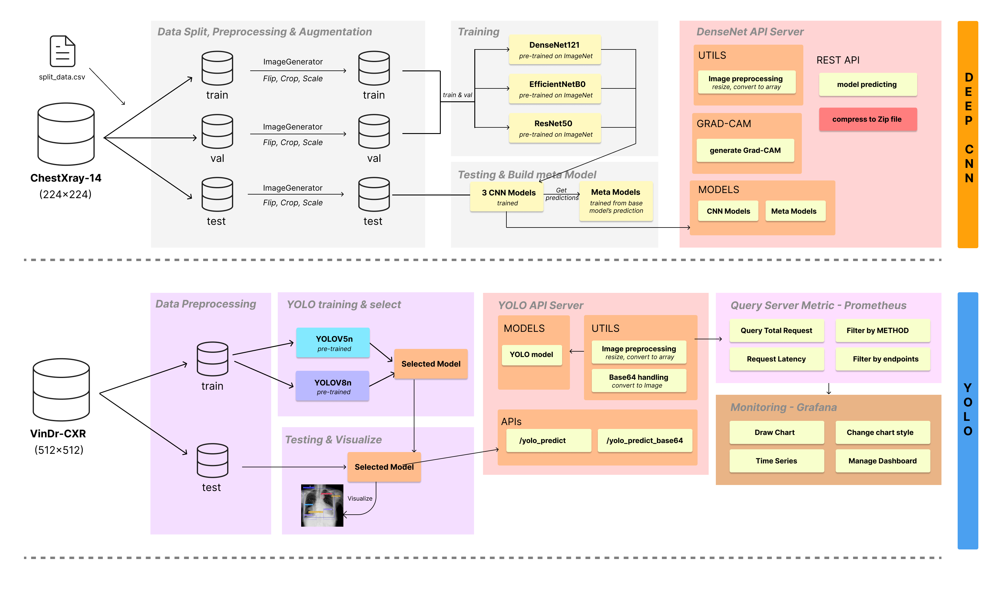

# Chest X-ray Disease Classification API

A FastAPI-based REST API that uses a DenseNet121 model to classify chest X-ray images for multiple diseases, featuring GradCAM visualizations to highlight suspicious areas.

## Features

- **Multi-disease Classification**: Simultaneously detects 14 different thoracic diseases and "No Finding" class
- **Visualization**: Generates GradCAM heatmaps to highlight regions of interest
- **Multiple Output Options**: Returns results as downloadable ZIP files or Cloudinary URLs
- **High Load Handling**: Uses Celery with Redis for asynchronous processing of requests
- **Performance Monitoring**: Includes Prometheus metrics and Flower dashboards
- **Health Checks**: Comprehensive health check endpoints for system components

## System Architecture



## System Data Flow

```
                                                   +----------------+
                                                   |                |
                                             +---> |  Cloudinary    |
                                             |     |                |
                                             |     +----------------+
                                             |
+------------+       +-----------------+     |     +----------------+
|            |       |                 |     |     |                |
|  Client    +-----> |  FastAPI Server | ----+---> |  File System   |
|            |       |                 |     |     |                |
+------------+       +--------+--------+     |     +----------------+
                              |              |
                              |              |     +----------------+
+---------------------+       |              |     |                |
|                     |       |              +---> |  Client (ZIP)  |
| Prometheus/Grafana  | <-----+                    |                |
|                     |       |                    +----------------+
+---------------------+       |
                              v
                     +----------------+          +---------------+
                     |                |          |               |
                     |  Redis Broker  | <------> |  Celery Tasks |
                     |                |          |               |
                     +----------------+          +-------+-------+
                                                         |
                              +--------------------+     |
                              |                    |     |
                              |  Health Check API  | <---+
                              |                    |
                              +--------------------+


Async Request Flow:
==================
1. Client --[POST /async/prediction]--> FastAPI
2. FastAPI --[task.delay()]--> Redis
3. FastAPI --[task_id]--> Client
4. Client --[GET /tasks/{task_id}]--> FastAPI (polls)
5. Celery Worker --[pop task]--> Redis
6. Celery Worker --[process image with DenseNet121]--> GPU/CPU
7. Celery Worker --[store result]--> Redis
8. Client --[GET /tasks/{task_id}/result]--> FastAPI
9. FastAPI --[fetch result]--> Redis
10. FastAPI --[return result]--> Client

Performance Metrics:
==================
* FastAPI --[export metrics]--> Prometheus
* Prometheus --[visualize]--> Grafana Dashboard
* Celery --[worker stats]--> Flower Dashboard
```

## Technologies

- **FastAPI**: High-performance Python web framework
- **TensorFlow/Keras**: For running the DenseNet121 model
- **Celery**: Distributed task queue for handling concurrent prediction requests
- **Redis**: Message broker for Celery tasks
- **Prometheus**: Metrics collection for monitoring
- **Cloudinary**: Cloud storage for image results

## Requirements

- Python 3.10+
- TensorFlow 2.19+
- FastAPI
- Redis
- Celery
- Pillow
- Matplotlib

## Installation

1. Clone the repository:
```bash
git clone https://github.com/yourusername/chest-xray-disease-multi-classification.git
cd chest-xray-disease-multi-classification/be-fastapi-cnn
```

2. Install dependencies:
```bash
pip install -r requirements.txt
```

3. Set up environment variables in `.env` file:
```
CLOUDINARY_API_KEY=your_api_key
CLOUDINARY_API_SECRET=your_api_secret
CLOUDINARY_CLOUD_NAME=your_cloud_name
MODEL_PATH=models/DenseNet121_epoch_30.keras
REDIS_URL=redis://localhost:6379/0
```

## Usage

### Running with Docker Compose (Recommended for Production)

The easiest way to run the entire stack with load balancing:

```bash
docker-compose up -d
```

This starts:
- FastAPI application on port 5000
- Redis on port 6379
- Two Celery workers for processing prediction tasks
- Flower monitoring dashboard on port 5555

### Running Components Separately (Development)

1. **Start Redis Server**:
```bash
# Install Redis if needed
sudo apt-get update
sudo apt-get install redis-server

# Start Redis service
sudo systemctl start redis-server
```

2. **Start Celery Workers**:
```bash
celery -A celery_config worker -Q prediction_tasks --loglevel=info
```

3. **Start Flower Dashboard (Optional)**:
```bash
celery -A celery_config flower --port=5555
```

4. **Start FastAPI Application**:
```bash
uvicorn main:app --host 0.0.0.0 --port 5000 --reload
```

## API Endpoints

### Synchronous Processing Endpoints

These endpoints process requests immediately:

#### 1. POST `/densenet_predict`
- Upload an X-ray image file and get ZIP with GradCAM results
- **Form Parameters**:
  - `file`: X-ray image file (required)
  - `font_size`: Font size for annotations (optional, default: 40)

#### 2. POST `/v2/densenet_predict`
- Send base64 encoded image and get Cloudinary URLs
- **JSON Body**:
  - `image`: Base64 encoded image string

### Asynchronous Processing Endpoints (For High Load)

These endpoints queue requests for processing:

#### 1. POST `/async/densenet_predict`
- Upload an X-ray file for asynchronous processing
- **Returns**: `task_id` for checking status later

#### 2. POST `/async/v2/densenet_predict`
- Send base64 image for asynchronous processing with Cloudinary
- **Returns**: `task_id` for checking status later

#### 3. GET `/tasks/{task_id}`
- Check the status of a task
- **Returns**: Current status of the task

#### 4. GET `/tasks/{task_id}/result`
- Get the result of a completed task
- **Returns**: ZIP file or Cloudinary URLs depending on task type

### Statistics and Monitoring

- GET `/stats/diseases/summary` - Summary of all disease predictions
- GET `/stats/diseases/weekly` - Weekly disease prediction statistics
- GET `/stats/diseases/daily` - Daily disease statistics for specified period
- GET `/metrics` - Prometheus metrics endpoint
- GET `/health` - Basic health check
- GET `/health/redis` - Redis connection status
- GET `/health/celery` - Celery workers status

## Performance Tuning

### Scaling Celery Workers

To handle increased load, you can:

1. **Add more worker replicas** in `docker-compose.yml`:
```yaml
celery-worker:
  deploy:
    replicas: 4  # Increase from default 2
```

2. **Adjust concurrency within workers**:
```bash
celery -A celery_config worker -Q prediction_tasks --concurrency=4 --loglevel=info
```

### Monitoring

- **Flower Dashboard**: Access at `http://localhost:5555` for real-time monitoring
- **Prometheus Metrics**: Access at `/metrics` endpoint
- **Health Check Endpoints**: `/health`, `/health/redis`, `/health/celery`

## Example API Usage

### Synchronous Request (Simple)

```python
import requests
import json
import base64

# Prepare the image
with open("chest_xray.jpg", "rb") as f:
    img_data = base64.b64encode(f.read()).decode('utf-8')

# Send the request
response = requests.post(
    "http://localhost:5000/v2/densenet_predict",
    json={"image": img_data}
)

# Process the result
result = response.json()
print("Image URLs:", result["image_urls"])
```

### Asynchronous Request (High Load)

```python
import requests
import json
import base64
import time

# Prepare the image
with open("chest_xray.jpg", "rb") as f:
    img_data = base64.b64encode(f.read()).decode('utf-8')

# Submit task
task_response = requests.post(
    "http://localhost:5000/async/v2/densenet_predict",
    json={"image": img_data}
)
task_id = task_response.json()["task_id"]
print(f"Task submitted with ID: {task_id}")

# Poll for result
while True:
    status_response = requests.get(f"http://localhost:5000/tasks/{task_id}")
    status = status_response.json()
    
    if status["status"] == "SUCCESS":
        # Get the result
        result_response = requests.get(f"http://localhost:5000/tasks/{task_id}/result")
        result = result_response.json()
        print("Image URLs:", result["image_urls"])
        break
    elif status["status"] == "FAILURE":
        print("Task failed:", status.get("error"))
        break
        
    print(f"Status: {status['status']}. Waiting...")
    time.sleep(1)
```

## Contributing

Contributions are welcome! Please feel free to submit a Pull Request.

## License

This project is licensed under the MIT License - see the LICENSE file for details.